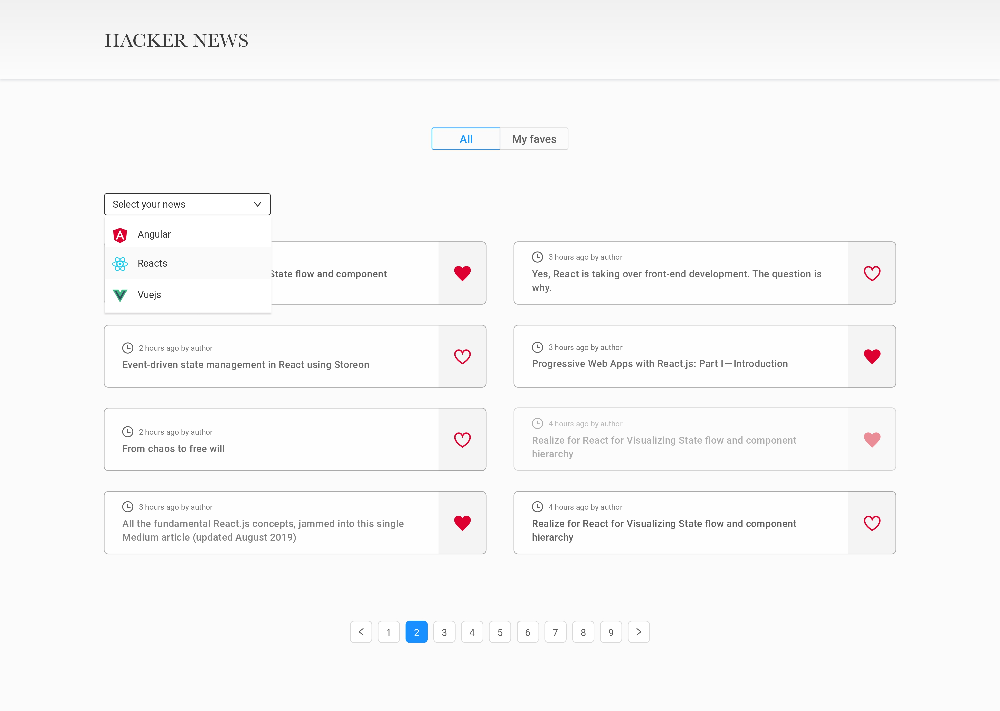

# 🖖 Prueba técnica frontend -  Reign
 



This is a [Vite.js](https://vitejs.dev/) and [React](https://es.reactjs.org/) project bootstrapped with [`vite@latest --template react`](https://vitejs.dev/guide/#scaffolding-your-first-vite-project).

Prueba técnica para Reign, basada en la creación de una web para leer noticias relacionadas con tecnologías web.

## Instalación

Este proyecto ha sido desarrollado en Vite + React, por lo que primero deberás instalar las dependencias correspondientes.

```
git clone https://github.com/donCelis/technical_test_reign.git
cd technical_test_reign
npm i -E
```

## Uso

### -Inicio del servidor

```bash
npm run dev
```

Puedes ver el sitio web en el siguiente enlace: `localhost:3000`.

### -Empaquetado de aplicación

```bash
npm run build
```

Si necesitas saber los demás comando de npm puedes consultar el archivo: `package.json`


## Info del proyecto

1. Este proyecto ha sido servido con datos desde una APIRest pública. [hn.algolia.com](https://hn.algolia.com/api)
2. Libreria frontend: [Bootstrap](https://getbootstrap.com/)
3. Estilos fueron creados con sass


## License

This project is open source and available under the [MIT License](LICENSE).
___
 
Copyright © 2020 - present [Alexander Celis](https://github.com/donCelis) 🇨🇴